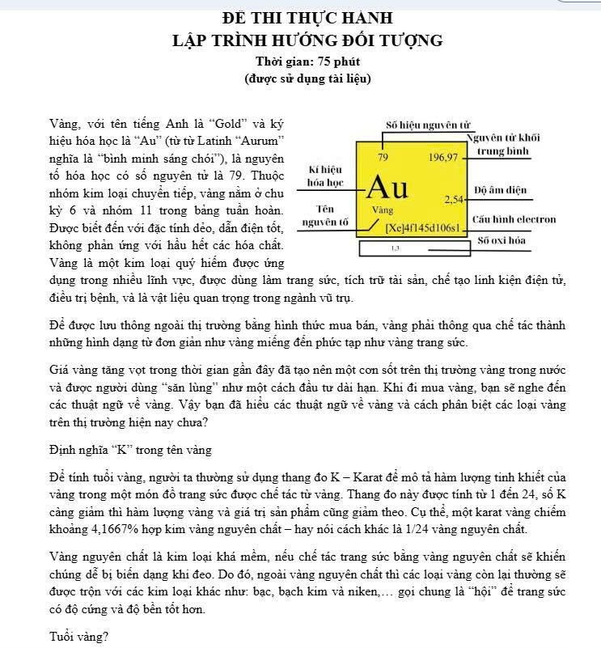
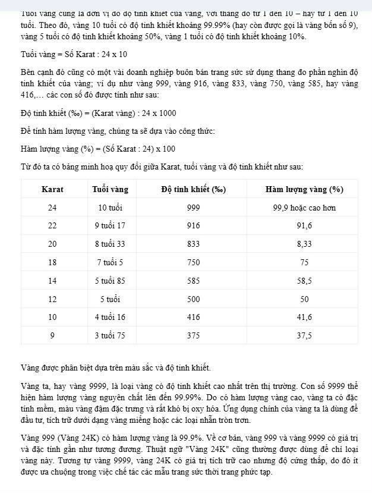
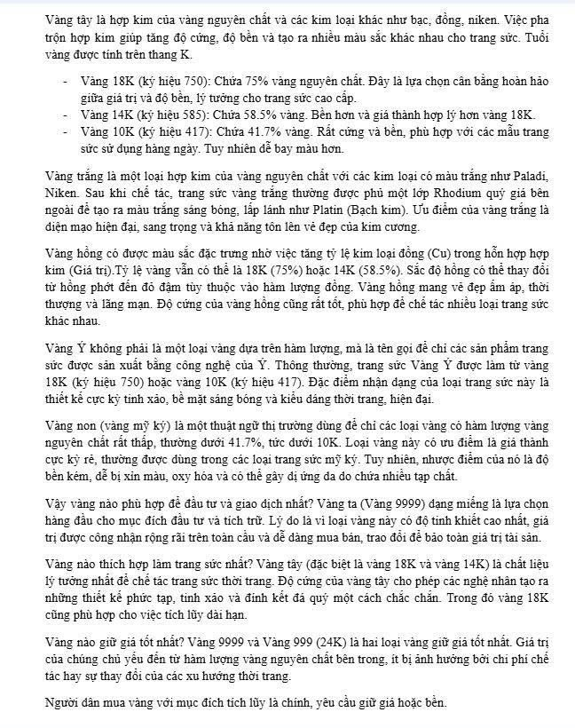
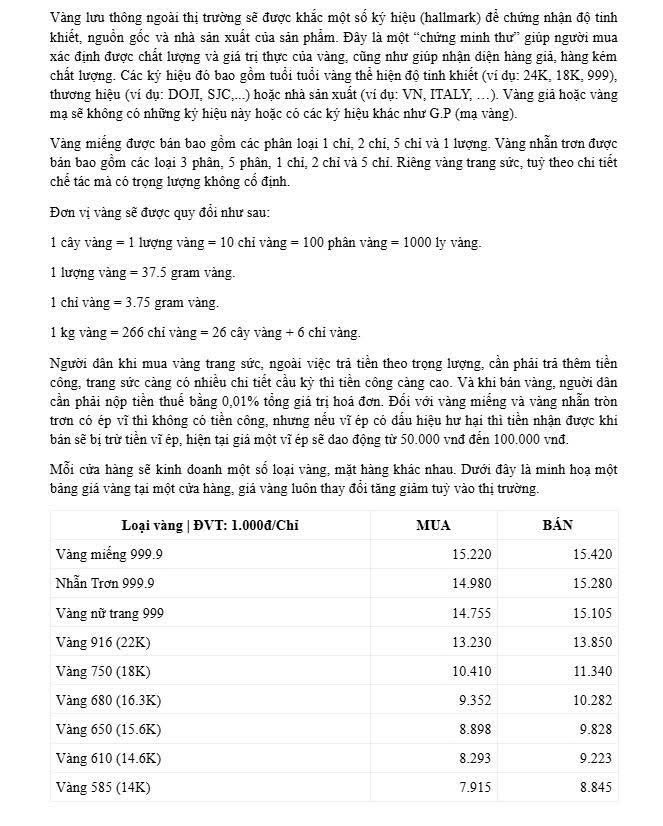
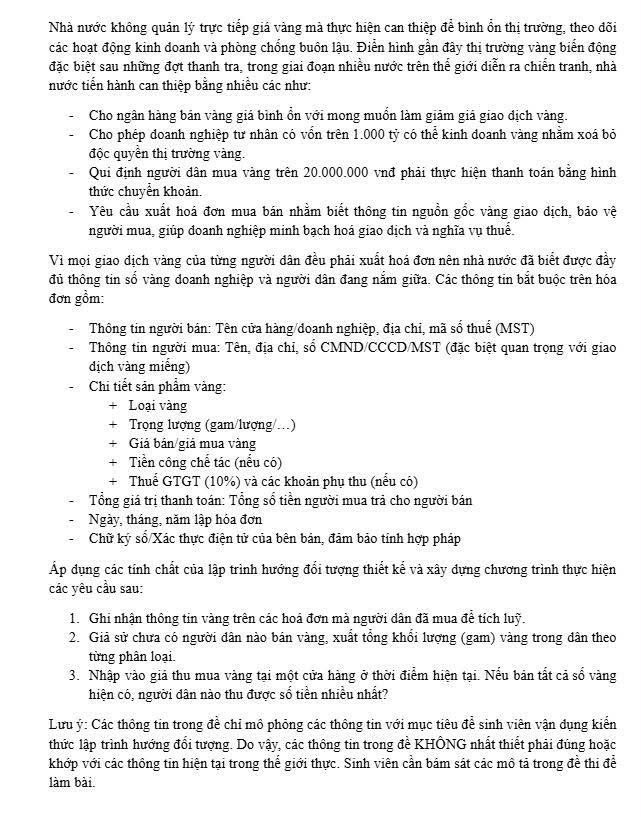

Lịch thi: 13h30 ngày 17/12/2025 (sinh viên đến sớm để chuẩn bị)

Nội dung thi: Kết hợp các tính chất lập trình hướng đối tượng, cài đặt chương trình và giải quyết bài toán theo yêu cầu đề (không có nội dung cài đặt toán tử).

Về ngôn ngữ sử dụng: Sử dụng ngôn ngữ theo đăng ký (mỗi đối tượng được lưu trữ trên các file riêng) 

Nếu sinh viên sử dụng Microsoft Visual Studio: 

1. Tạo solution đặt tên là MSSV, chọn Empty Project đặt tên là HoTen

2. Mỗi class chọn add new class, đặt tên trùng với tên lớp, code 1 class được viết trên 2 file trong đó 

1 file .h  dùng để chèn thư viện, khai báo lớp, hàm inline 

1 file .cpp  dùng để định nghĩa các hàm còn lại

3. Add new item chọn cpp, tạo 1 file Source.cpp dùng để cài đặt hàm main.

4. Nộp bài: Xoá các thư mục debug, .vs và file db, nén toàn bộ solution MSSV để nộp

Nếu dùng Visual Studio Code

1. Tạo thư mục tên MSSV dùng để chứa các file cài đặt

2. Với mỗi class, tạo 1 file .h (hoặc 1 file .cpp hoặc bao gồm 1 file .h và 1 file .cpp) đặt tên trùng với tên lớp, file của lớp nào thì chứa code định nghĩa và cài đặt cho lớp đó

3. Tạo 1 file Source.cpp dùng để cài đặt hàm main

4. Nộp bài: nén thư mục MSSV đã tạo trước đó để nộp

Trường hợp khác: tương tự
Trình tự thi:

1. Mở máy tính, tạo sẵn project, Phát giấy thi, giấy nháp

2. Truy cập file đề thi

3. Sinh viên có 20-30 phút chuẩn bị bao gồm đọc đề và vẽ sơ đồ thiết kế lớp. Lưu ý trong thời gian này sinh viên không được sử dụng tài liệu.

4. Thu bài giấy

5. Sinh viên có khoảng 30-45 phút viết code. Trong thời gian này sinh viên được sử dụng tài liệu.

Lưu ý: 

1. Khi chèn thư viện, chỉ chèn những thư viện được sử dụng để giải bài toán

2. Các trường hợp thiết kế giấy khác thiết kế trong code; copy bài nhau; sử dụng AI đều nhận điểm 0.

Đề thi:

