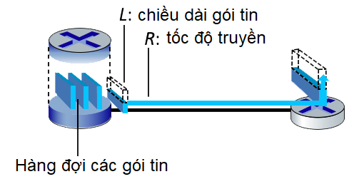

Câu hỏi 1
Đúng
Đạt điểm 10,00 trên 10,00
Đặt cờ
Đoạn văn câu hỏi
BÀI TẬP - Tính Độ trễ truyền
Cho các thông tin như sau, hãy Tính độ trễ truyền (thời gian cần thiết để router truyền một gói tin ra đường liên kết) và điền vào kết quả:

Xem hình sau đây, trong đó một bộ định tuyến đang truyền các gói, mỗi gói tin có chiều dài L và đường liên kết giữa 2 router có tốc độ truyền R. Hãy tính độ trễ truyền (theo đơn vị giây), nếu có: L = 12 Kb và R = 1 Mbps.

Lưu ý: Điền theo đơn vị giây. Ví dụ: 0.05
Answer: Câu hỏi 1
0.012
