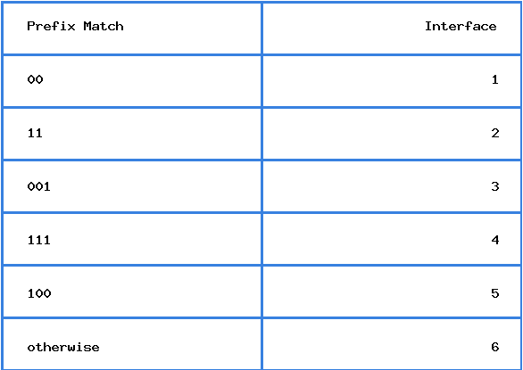
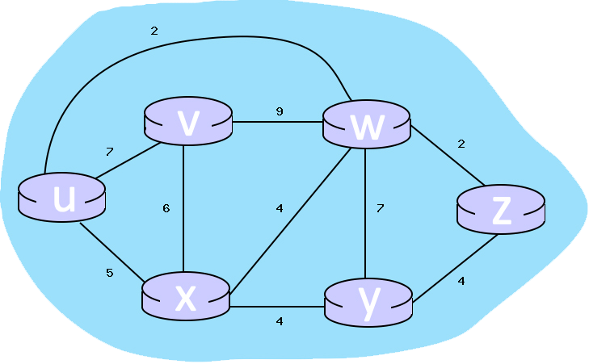
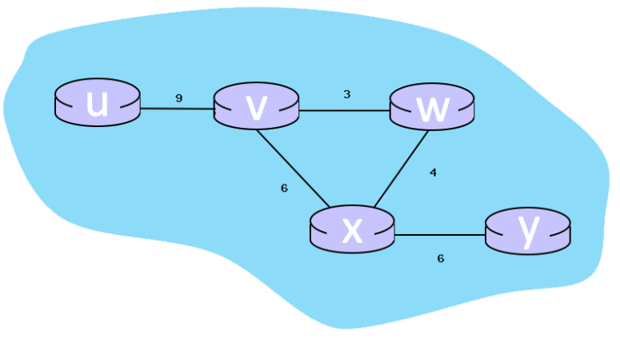

Câu hỏi 1
Đúng
Đạt điểm 1,00 trên 1,00
Đặt cờ
Đoạn văn câu hỏi
Địa chỉ nào sau đây là một địa chỉ mạng?
Câu hỏi 1Trả lời

a.
192.169.0.0

b.
172.16.1.0

c.
0.0.0.0

d.
10.100.0.0
Phản hồi
The correct answer is: 192.169.0.0
Câu hỏi 2
Đúng
Đạt điểm 1,00 trên 1,00
Đặt cờ
Đoạn văn câu hỏi
Cho mạng 192.168.100.0/24. Chia mạng thành 8 mạng con. Phát biểu nào sau đây sai?
Câu hỏi 2Trả lời

a.
Địa chỉ 192.168.100.31 là một địa chỉ broadcast

b.
Mỗi subnet có 32 địa chỉ dùng được cho host

c.
Subnet mask của mạng con là 255.255.255.224

d.
Địa chỉ 192.168.100.64 là một địa chỉ mạng
Phản hồi
The correct answer is: Mỗi subnet có 32 địa chỉ dùng được cho host
Câu hỏi 3
Đúng
Đạt điểm 1,00 trên 1,00
Đặt cờ
Đoạn văn câu hỏi
Địa chỉ nào sau đây là địa chỉ quảng bá của mạng 192.168.25.128/27
Câu hỏi 3Trả lời

a.
192.168.25.128

b.
192.168.25.100

c.
192.168.25.255

d.
192.168.25.159
Phản hồi
The correct answer is: 192.168.25.159
Câu hỏi 4
Đúng
Đạt điểm 1,00 trên 1,00
Đặt cờ
Đoạn văn câu hỏi
Phát biểu nào sau đây SAI về địa chỉ IP 172.32.1.255/16?
Câu hỏi 4Trả lời

a.
Là một địa chỉ quảng bá (broadcast)

b.
Thuộc Lớp B

c.
Có subnet mask chuẩn là 255.255.0.0

d.
Là một địa chỉ Public
Phản hồi
The correct answer is: Là một địa chỉ quảng bá (broadcast)
Câu hỏi 5
Đúng
Đạt điểm 1,00 trên 1,00
Đặt cờ
Đoạn văn câu hỏi
Cho địa chỉ IP: 172.16.8.159 và subnet mask tương ứng 255.255.255.192. Xác định địa chỉ mạng của IP trên?
Câu hỏi 5Trả lời

a.
172.16.0.0

b.
172.16.8.128

c.
172.16.8.150

d.
172.16.8.0
Phản hồi
The correct answer is: 172.16.8.128
Câu hỏi 6
Đúng
Đạt điểm 1,00 trên 1,00
Đặt cờ
Đoạn văn câu hỏi
Cho bảng forwarding như sau:

Giả sử router tiếp nhận và chuyển tiếp các gói tin có địa chỉ đích là địa chỉ 8bits và sử dụng phương pháp "Longest match prefix" - So sánh phần đầu dài nhất.

Xác định địch chỉ đích và interface tương ứng cho các trường hợp dưới đây.

01100100

Answer 1 Câu hỏi 6
6
 
10111110

Answer 2 Câu hỏi 6
6
 
00100110

Answer 3 Câu hỏi 6
3
 
Phản hồi
Câu trả lời của bạn đúng
The correct answer is:
01100100 → 6,

10111110 → 6,

00100110 → 3

Câu hỏi 7
Đúng
Đạt điểm 1,00 trên 1,00
Đặt cờ
Đoạn văn câu hỏi
Cho mô hình đồ thị biểu diễn sự kết nối và chi phí kết nối giữa các router như hình minh họa bên dưới. Dùng thuật toán Dijkstra để xác định đường đi ngắn nhất từ đỉnh u đến các đỉnh còn lại bằng cách chọn link tương ứng từ u với từng đích đến cho trước.

Ví dụ: Với đỉnh đích là y: nếu đường ngắn nhất từ u đến y đi qua u --> x thì chọn (u,x), nếu đường ngắn nhất này đi qua u --> v thì chọn (u,v), tương tự khi xét (u,w)

z

Answer 1 Câu hỏi 7
(u,w)
 
x

Answer 2 Câu hỏi 7
(u,x)
 
v

Answer 3 Câu hỏi 7
(u,v)
 
w

Answer 4 Câu hỏi 7
(u,w)
 
y

Answer 5 Câu hỏi 7
(u,w)
 
Phản hồi
Câu trả lời của bạn đúng
The correct answer is:
z → (u,w),

x → (u,x),

v → (u,v),

w → (u,w),

y → (u,w)

Câu hỏi 8
Đúng
Đạt điểm 1,00 trên 1,00
Đặt cờ
Đoạn văn câu hỏi
Cho mô hình mạng như sau, giả sử các router sử dụng thuật toán Bellman-Ford, hãy xác định vector khởi tạo ban đầu của w (trình bày dưới dạng u,v,x,y,w - nếu là ∞ thì viết là x.

Answer: Câu hỏi 8
x,3,4,x,0
Phản hồi
The correct answer is: x,3,4,x,0
Câu hỏi 9
Đúng
Đạt điểm 1,00 trên 1,00
Đặt cờ
Đoạn văn câu hỏi
Khi gửi một gói tin IPv4 có kích thước là 4.560 byte vào một mạng có kích thước của MTU là 1500 byte, gói tin ban đầu sẽ được chia thành các gói nhỏ. Biết kích thước của phần header các gói tin là 20 byte, kích thước của các gói tin lần lượt là?

Gói tin 1 Blank 1 Câu hỏi 9
1500 (offset 0)
 

Gói tin 2 Blank 2 Câu hỏi 9
1500 (offset 185)
 

Gói tin 3 Blank 3 Câu hỏi 9
1500 (offset 370)
 

Gói tin 4 Blank 4 Câu hỏi 9
120
 

Phản hồi
Câu trả lời của bạn đúng

The correct answer is:
Khi gửi một gói tin IPv4 có kích thước là 4.560 byte vào một mạng có kích thước của MTU là 1500 byte, gói tin ban đầu sẽ được chia thành các gói nhỏ. Biết kích thước của phần header các gói tin là 20 byte, kích thước của các gói tin lần lượt là?

Gói tin 1 [1500 (offset 0)]

Gói tin 2 [1500 (offset 185)]

Gói tin 3 [1500 (offset 370)]

Gói tin 4 [120]

Câu hỏi 10
Đúng
Đạt điểm 1,00 trên 1,00
Đặt cờ
Đoạn văn câu hỏi
Một user than phiền với bạn rằng họ không thể truy cập được Internet dù giao tiếp bình thường với các máy trong cùng mạng. Bạn kiểm tra lại các thông số của user này và thu được các giá trị lần lượt như sau: địa chỉ IP: 10.0.37.144; subnet mask: 255.255.254.0; default gateway: 10.0.38.1. Vấn đề phát sinh ở đây là:

Câu hỏi 10Trả lời

a.
Địa chỉ IP và mask không phù hợp

b.
Gateway không đúng

c.
Địa chỉ IP không hợp lệ

d.
Subnet mask không hợp lệ

Phản hồi
The correct answer is: Gateway không đúng
