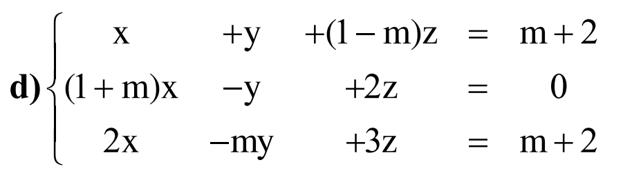
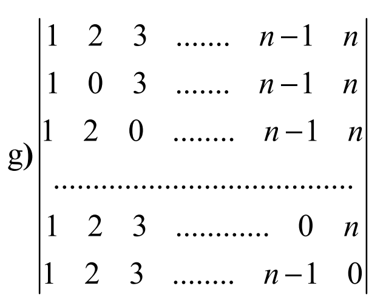
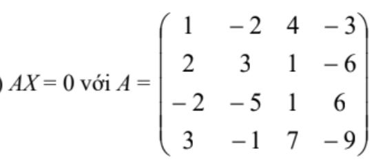
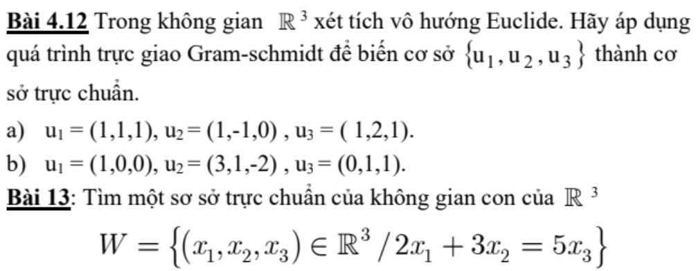
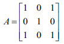
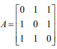

### BT3:

Tính định thức cấp n

Giải và biện luận theo m

### BT4: 

Câu 1. Tập V={(x,y,z) in R^3/x+y=z} có là không gian con của R^3 không?

Câu 2. Chứng minh rằng `<S>` là một không gian con của R^2, với S={u=(1,2)}

Câu 3. Trong R^3, xét tính độc lập tuyến tính, phụ thuộc tuyến tính của S={u1=(1,1,1), u2=(1,m,1), u3=(1,1,m)}

Câu 4. Trong P2[x] tìm đk để p=1+ax+bx^2 thuộc `<S>`, S={u1=1-x, u2=1+x^2}

### BT6: 

Câu 1.

Tìm cơ sở và số chiều của không gian nghiệm của hệ thuần nhất sau

Câu 2. 

### BT7: 

1. Ma trận sau có chéo hóa được không? Có chéo hóa trực giao được không?

a) 

2. Tìm một cơ sở trực chuẩn của không gian con W trong R^3

W={(x1,x2,x3) in R^3/x1+2x2+3x3=0}

3. Tính A^n,

