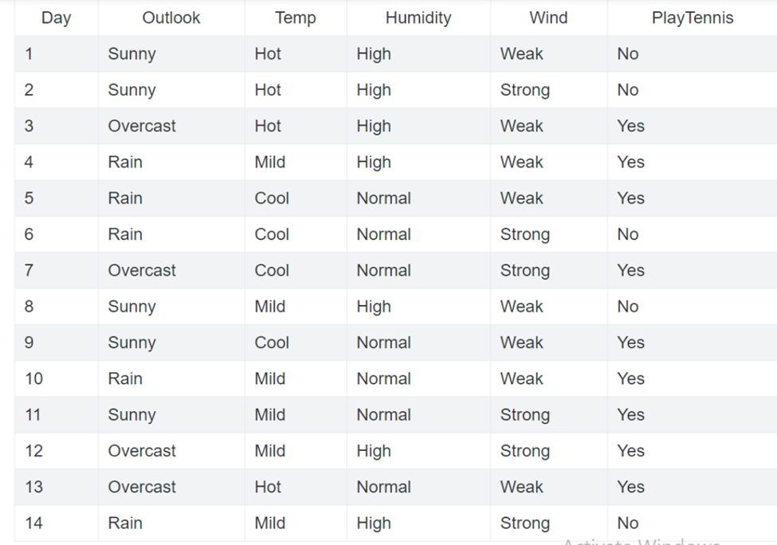
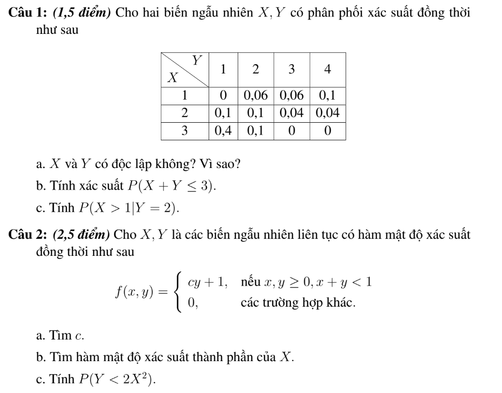

## Bài tập VN 1

**1.11.** Một lớp có 45 học sinh trong đó có 20 nam. Hỏi có bao nhiêu cách lập nhóm gồm:
a) 3 học sinh.
b) 3 học sinh gồm 2 nam 1 nữ.

**1.16.** Từ các chữ số 0, 1, 2, 3, 4, 5 có thể lập được bao nhiêu số tự nhiên chẵn gồm 4 chữ số đôi một khác nhau mà chữ số đầu tiên là chữ số lẻ.

**1.17.** Có 3 đường thẳng song song nằm ngang cắt 5 đường thẳng song song thẳng đứng. Hỏi có bao nhiêu hình chữ nhật được tạo thành (có giải thích)? Mở rộng cho m và n đường thẳng.

--- 

## Bài tập VN 2

Bài 1. Bắn 3 viên đạn một cách độc lập vào một bia. Xác suất trúng bia của mỗi viên lần lượt là 0.6; 0.9; 0.7. Tìm xác suất: 

a) Có đúng một viên trúng đích.

b) Có ít nhất một viên trúng đích.

Bài 2. Có 3 hộp phấn. Hộp I có 15 viên tốt và 5 viên xấu; Hộp II có 10 viên tốt và 4 viên xấu; Hộp III có 20 viên tốt và 10 viên xấu. Lấy ngẫu nhiên mỗi hộp 1 viên phấn. Tìm xác suất được ít nhất một viên phấn tốt.

Bài 3. Viết chương trình tính gần đúng số Pi

Bài 4. Viết chương trình tính gần đúng hàm Laplace $\varphi(x) = \frac{1}{\sqrt{2\pi}} \int_{0}^{x} e^{-t^2/2} dt$ (Đáp số gần đúng: Chẳng hạn ki x= 1.96 thì giá trị hàm Laplace là 0.475)

HD: SV chụp màn hình CT và ghép với các bài tập trước vào 1 file để nộp

---

## Bài tập VN 3

1. Hai người A và B cùng chơi trò chơi như sau: Cả hai luân phiên lấy mỗi lần 1 viên bi từ một hộp đựng 2 bi trắng và 5 bi đen (bi được lấy ra không trả lại hộp). Người nào lấy được bi trắng trước thì thắng cuộc. Giả sử A lấy trước, tính xác suất A thắng cuộc?
2. Cho dữ liệu điểm thi học phần XSTK trong link tài liệu.
a) Tính thêm cột điểm học phần với các trọng số tp là 20, 20, 60%.
b) Quan sát ngẫu nhiên 1 SV, tính xác suất SV đó qua học phần
c) Quan sát n/n 1 sv thấy sv đó thi chưa đạt kỳ thi giữa kỳ, tính xác suất người đó thì đạt kỳ thi cuối kỳ. 

d) Quan sát n/n 1 SV thì thấy SV đó đã thi qua học phần. Tính xác suất SV này thi chưa đạt ở kỳ thi giũa kỳ

---

## Bài tập VN 4

Câu 1: Cho dữ liệu chơi tennis như bên dưới. Nếu một ngày mà outlook=sunny, temp=hot, humidity=normal, wind=weak thì có chơi tennis không? Tại sao?

Câu 2:

Một công ty có 5 xe tải và 3 xe con. Biết xác suất sự cố trong tháng của mỗi xe tải là 0,1; còn của mỗi xe con là 0,02. Trong tháng nào đó, chọn ngẫu nhiên 2 xe của công ty để kiểm tra. 

a) Đặt X là số xe tải có trong 2 xe đem kiểm tra. Lập luật phân phối xác suất cho X.

b) Tính xác suất để trong hai xe được kiểm tra có đúng 1 xe bị sự cố. 

c) Biết có ít nhất 1 xe bị sự cố trong 2 xe được kiểm tra; tính xác suất để trong số xe bị sự cố có đúng 1 xe con.

---

## Bài tập 5

